## Hi there 👋

I am Tobi, a PhD student at the Astroparticle Group of the University of Innsbruck (Austria).

My research is focused on forward-folding based multiwavelength analysis for IACTs.

Some of my current involvements: 
- [threeML](https://github.com/threeML/threeML) with its modelling package [astromodels](https://github.com/threeML/astromodels)
- [gammapy-plugin](https://github.com/threeML/gammapy-plugin) a `gammapy` plugin for `threeML`

